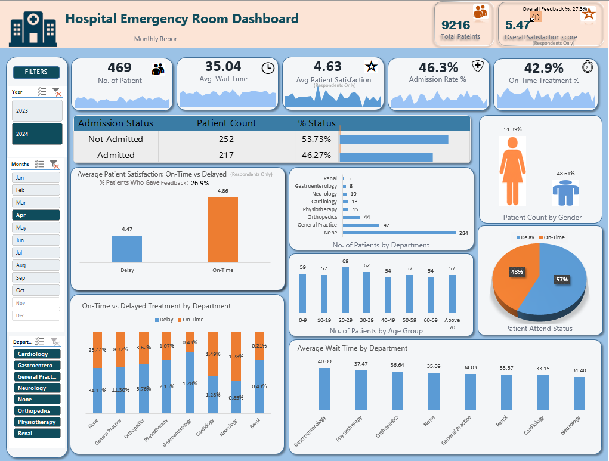
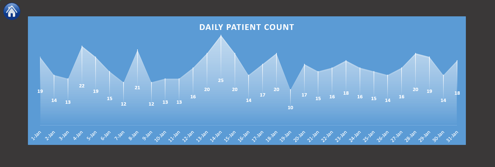
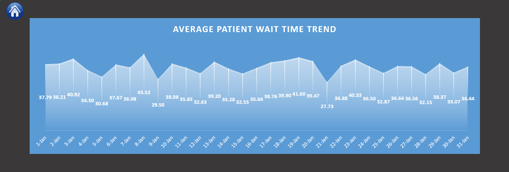
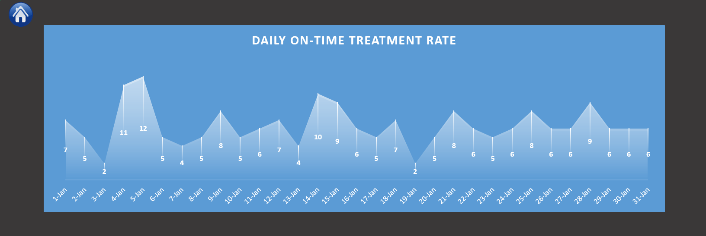

# 🏥 Hospital Emergency Room Analytics Dashboard

## 📌 Project Overview
This project presents an **end-to-end Emergency Room (ER) analytics dashboard built in Microsoft Excel**, designed to improve operational efficiency and patient experience.

The dashboard transforms raw healthcare data into **actionable insights** using Power Query, Power Pivot, and DAX, following a structured analytics workflow similar to real-world business environments.

---

## 🎯 Business Objective
The goal of this project is to help hospital stakeholders:
- Monitor ER performance
- Identify bottlenecks and delays
- Track patient satisfaction and admissions
- Improve patient flow and service quality through data-driven decisions

---

## 📊 Key KPIs Tracked
- **Total Patients** (Overall, Daily, Monthly)
- **Average Wait Time**
- **Patient Satisfaction Score (Respondents Only)**
- **Admission Rate**
- **On-Time Treatment %**
- **Age Group & Gender Distribution**
- **Department-wise Performance**
- **Daily Trends for all KPIs**

> ⚠️ Patient Satisfaction is calculated using **only respondents**, with feedback response rate displayed to avoid bias due to missing values.

---

## 🗂 Dataset Information
- Source: `Hospital_ER_Data.csv`
- Date Range: **April 2023 – October 2024**
- Records: Patient-level ER visits

Key fields include Patient ID, Admission Date & Time, Gender, Age, Department Referral, Admission Status, Wait Time, and Satisfaction Score.

---

## 🛠 Tools & Technologies
- Microsoft Excel  
- Power Query (Data Cleaning & Transformation)  
- Power Pivot (Data Modeling)  
- DAX (Calculated Columns & Measures)  
- Pivot Tables & Charts  
- Slicers & Interactive Navigation  

---

## 🔄 Project Workflow
1. Data Extraction (CSV import)
2. Data Cleaning using Power Query
3. Calendar Table creation for time-series analysis
4. Data Modeling using Power Pivot
5. KPI calculations using DAX
6. Dashboard design and visualization
7. Interactive filtering and drill-through navigation

---

## 📈 Key Insights

* **9,216 total patients** recorded across the analysis period 
  (April 2023 – October 2024)
* **Average wait time of 35.04 minutes** across all departments
* **Admission rate of 46.3%** — nearly half of all ER patients 
  required admission
* **On-time treatment rate of 42.9%** — indicating significant 
  room for operational improvement
* **Overall patient satisfaction score of 5.47** (respondents only) 
  with only **27.5% feedback response rate** — highlighting 
  response bias risk in satisfaction reporting
* **General Practice** is the highest-volume department with 284 
  patients, followed by Orthopedics (44) and Physiotherapy (15)
* Female patients represent **51.39%** of total ER visits

---

## 📸 Dashboard Preview

### Overview

### Daily Patient Trends

### Average Wait Time Trend

### Daily Admission Rate

### On-Time Treatment Trend

### Patient Satisfaction Score

---

## 📌 Final Outcome
This dashboard provides a single, interactive view of ER performance, helping decision-makers identify operational inefficiencies and improve patient experience.

---

## 👩‍💻 Author  
**Harshitha Salian**  
Analytics Professional | SQL · Power BI · Excel · Python  
📍 Dubai, UAE | [LinkedIn](https://www.linkedin.com/in/salianharshitha/) | [GitHub](https://github.com/Harshitha092)

